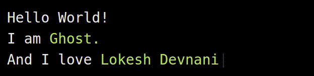

# ghost-typer.js
Jquery Plugin for simulating typing magically.

See [https://lokeshthegenius.github.io/ghost-typer](https://lokeshthegenius.github.io/ghost-typer)

## Demo
Have a demo? Let me know and I'll include it here.



Another nice demo at: [My website](https://lokeshd.com)

## Installation
+ You can either download the files from here or just copy the code from the [file](ghost-typer.js) as its less than 2kb(uncompressed) and ~1kb(minified).

+ You can install it with bower
```
bower install ghosttyper
```

## How to use
Ghost-typer have the defaults set to values which you would normally prefer. But, you can customize a lot of things if you want more control such as speed control, pause timings, repetitions & custom callbacks.

### Basic Usage

Include Jquery in your document. Ghost-typer.js supports all versions of jquery.
```
<script src="//ajax.googleapis.com/ajax/libs/jquery/1.11.2/jquery.min.js"></script>
```
Include ghost-typer.js after including Jquery
```
<script src="ghost-typer.min.js"></script>
```
Choose any div or span you want to target for typing simulation using jquery and apply the plugin by `selector.ghosttyper()`
```
$("#typing").ghosttyper({
    messages: ['anything', 'you want', 'it to','type']
});
```
Here, `"#typing"` is the container for simulation which can be a `span` or a `div`.
And `messages` is an option through which we will pass the text we want it to simulate the typing.

**Note**: `messages` is an array of text which will be displayed one at a time and is the only option which is mandatory.

### Advanced Usage
There are a couple of options which can be altered by passing an options object.

```
$("#typing").ghosttyper(options);
```
```
$("#typing").ghosttyper({
    messages: ['web development', '<coding>', 'dancing','technology'],
    timeWrite: 50,  //time between displaying each chracter
    timeDelete: 30, //time between removing(backspace) each chracter
    timePause: 800, //waiting time after displaying text
    repeat: false,  //loop it indefinitely
    callback: function() {
        console.log('called when the entire array of messages has been completed.');
    }
});
```
All the above options is optional & can be left off.

**Note**: The callback will only be called after completion of entire process. Thus, will never be called if repeat is set to true.

## Options

Options which can be passed as key value pairs as options object.

| Options Key             | Description                                                                                                                          | Default Value | Mandatory |
|-------------------------|--------------------------------------------------------------------------------------------------------------------------------------|---------------|-----------|
| messages: Array(String) | The messages which will be ghost-typed                                                                                               | undefined     | Y         |
| timeWrite: Integer      | time(in ms) interval between displaying each character                                                                               | 100           | N         |
| timeDelete: Integer     | time(in ms) interval between erasing each character                                                                                  | 50            | N         |
| timePause: Integer      | time(in ms) interval for which the text stays after its typed                                                                        | 1000          | N         |
| repeat: Boolean         | Whether or not to repeat the whole thing indefinitely                                                                                | true          | N         |
| callback: function      | The callback function which will get called after the whole process is completed. It is applicable only when repeat is set to false. | undefined     | N         |
=======

## Contribute
+ Report issues & add feature requests
+ Clone the repo. Fix bugs, add features & send a pull request.

## License
Open source license [GNU GPLv3](LICENSE)
